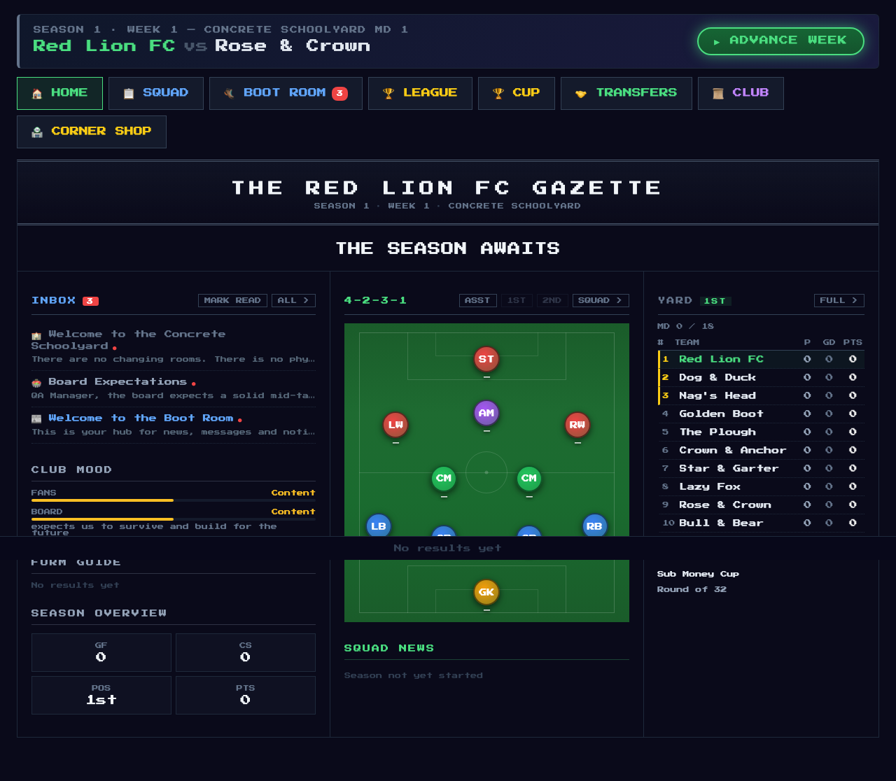
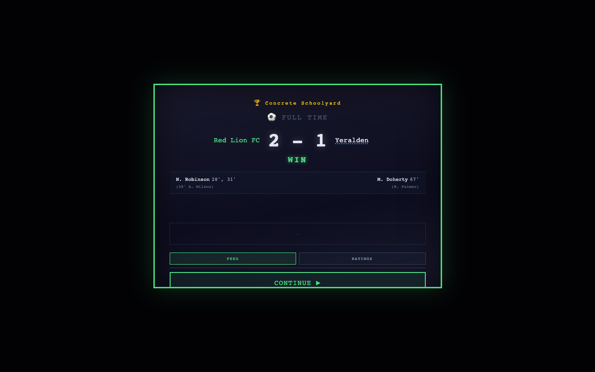
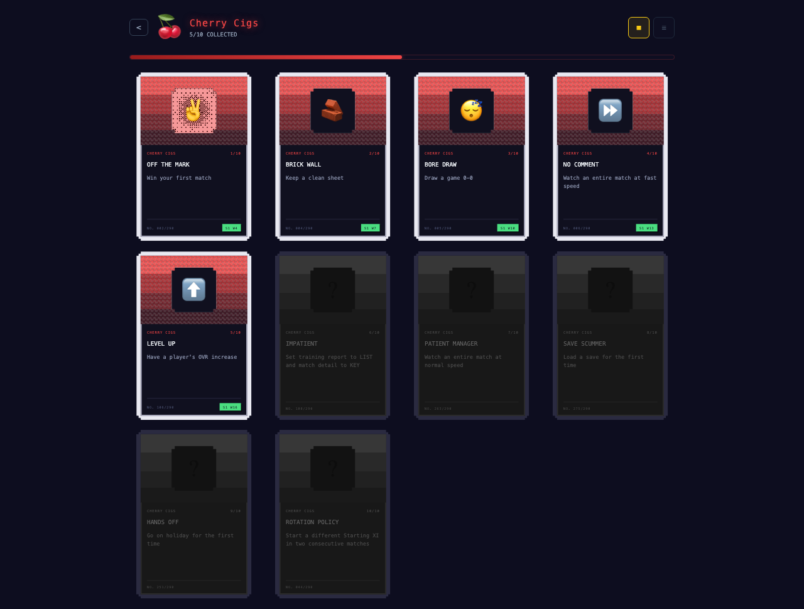
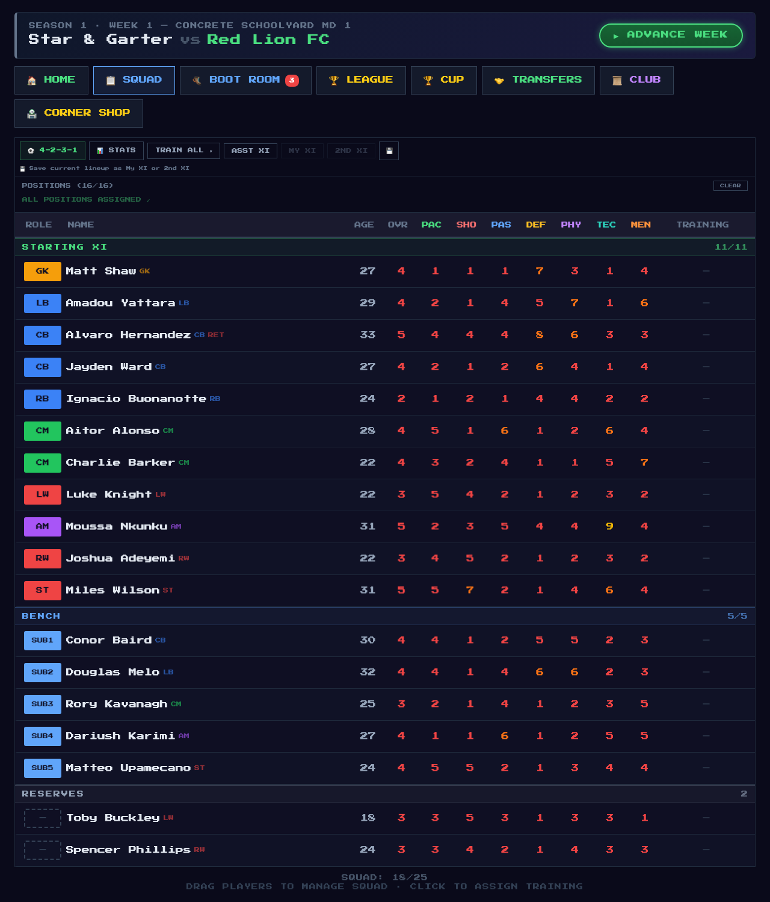

# Fruit Cigs

Build your team, go from the schoolyard to the top of the football pyramid, one +1 at a time. Fruit Cigs is a retro football sim that revels in simple pleasures and gives you space to create your own narrative.

A love letter to FIFA, Championship Manager, Ultimate Soccer Manager, and This Is Football.

---



## Features

**11-tier league pyramid** — Work your way up from the Concrete Schoolyard to the Intergalactic Elite. Each league has its own identity, rules, and gameplay modifiers — some end their season in knockout tournaments where qualification is everything.

**Match simulation** — Live text commentary with goals, cards, substitutions, and tactical shifts. Rivalries build from your head-to-head history and get their own kickoff lines. Watch it unfold or skip ahead.



**Cig cards** — 290 hidden achievements presented as collectible cigarette cards, filed into themed packs that unseal as your career deepens. Every card is earnable at any time; you just can't see how until the pack opens. WebGL foil on the good ones.



**Training & development** — Every week your players train. Watch attributes tick up one point at a time, with the player panel showing exactly which attributes your position actually weighs. Injuries happen. Breakthroughs happen. The +1 never gets old.


**Squad management** — Set formations, assign roles, manage your bench. Every player has 7 attributes, a position, a potential, and a story — homegrown academy graduates carry the badge to prove it.



**The back page** — Your career has its own newspaper. Match headlines, season previews that know your tenure, cup final front pages, and an end-of-season Awards Night: Golden Boot, Young Player, Player of the Season.

**Story arcs** — Multi-step narrative challenges that reward you for how you play. Youth Revolution, The Machine, Redemption, and more.


**Transfers & scouting** — Scout, trial, sign, and sell. A target's potential stays hidden until your scouts have done the work — shortlist them and wait, or burn a ticket for the instant dossier. Build relationships with rival clubs. Raid their squads or watch them raid yours.

**Cup competitions** — Knockout tournaments running alongside the league. Giant-killings included.

**A living world** — Every division plays its season whether you're watching or not, and every final table is archived. Check who won the Saudi Super League in Season 3 of your ten-season save. The club mood tracks how fans and board feel about you — and tells you why.

**Prestige system** — Win the top league and prestige to reset with higher OVR caps, tougher AI, and a fresh pyramid to climb.

**Unlockable players** — Hit the right achievements and earn unique players with their own flavour text and boosted stats.

**Ironman mode** — One save, no reloading. Get sacked and it's over.

## Tech

- React + Vite, Zustand store
- No backend — runs entirely in the browser
- Saves to IndexedDB via Dexie (export/import supported, versioned records,
  rotating backups). One storage adapter (`src/persistence/storage.js`) owns
  all persistence: Zustand is the live source of truth, Dexie is disk. Every
  save replacement atomically banks the displaced payload as one of up to 10
  rotating backups per slot, so a failed write changes nothing and a bad one
  can be undone. Loading falls back to the newest backup (loudly) if the
  active record is missing, and refuses records written by a newer build.
  Settings stay in localStorage on purpose — a corrupt game DB can never
  take preferences down with it. Backups live in the same browser database:
  they protect against bad writes and bad imports, **not** against clearing
  site data — external backup (export files) is the answer there, and the
  remaining durability work is tracked in #449.
- `Press Start 2P` pixel font throughout
- Tested with Vitest + a Playwright visual QA harness

## Running locally

```
npm install
npx --no vite
```

Opens at `http://localhost:5173`.

## Testing

```
npx vitest run        # unit tests
npm run qa            # Playwright suite: component fixtures + full-app flows, desktop + mobile
```
